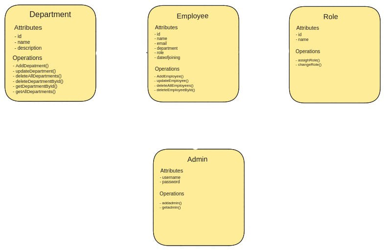

# Employee Management System

### Overview
The Employee Management System is a Java project built using Spring Boot. It facilitates the management of employee data within an organization.

### Features
- **Database Integration**: Utilizes PostgreSQL database for storing employee information.
- **Spring Data JPA**: Implements Spring Data JPA repositories for database operations.
- **Web Interface**: Provides a web interface accessible through Tomcat server.
- **Docker Compatibility**: Integrated with Docker Compose for deployment.

### Class Diagram

### Setup
1. **Dependencies**: Requires Java 22.0.1 and PostgreSQL 16.2.
2. **Database Configuration**: Connects to PostgreSQL database via JDBC URL `jdbc:postgresql://127.0.0.1:6900/employee`.
3. **Web Server**: Initializes Tomcat server on port 8080.
4. **Persistence**: Utilizes Hibernate ORM for managing JPA entities.

### How to Use
1. Clone the repository.
2. Set up PostgreSQL database with the specified configuration.
3. Build and run the project using Spring Boot.

### Additional Notes
- Ensure Docker Compose services are not already running to prevent conflicts.
- Handle any potential warnings or errors during setup, such as missing migrations.
